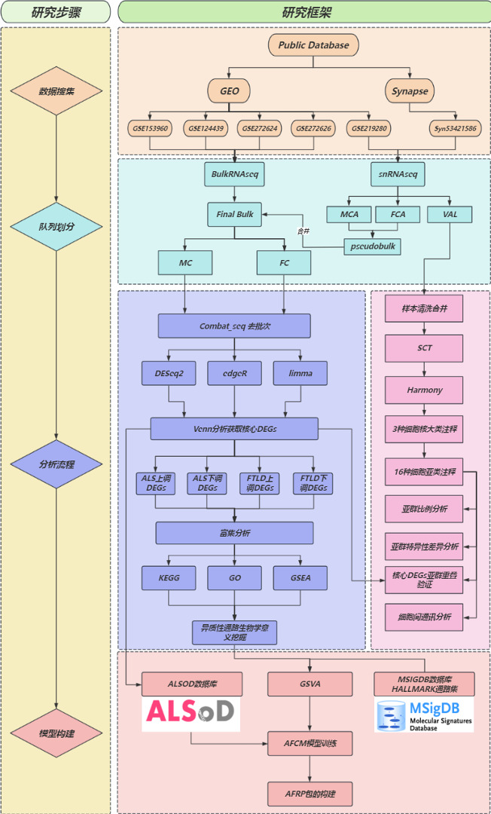
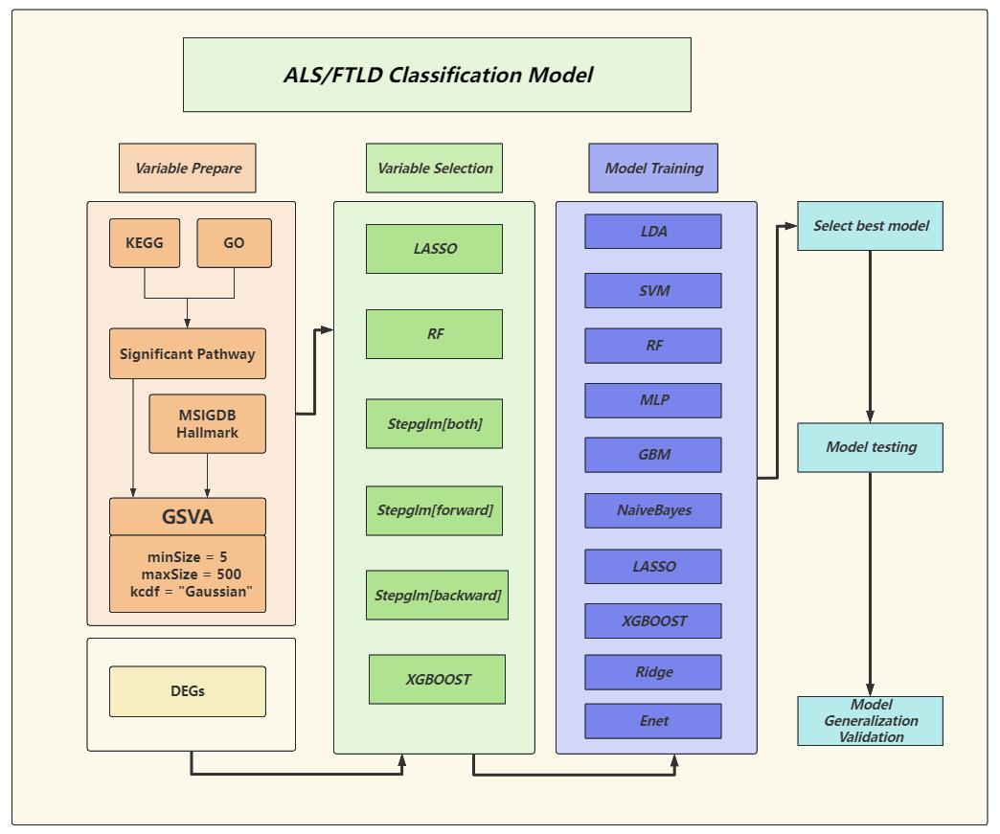
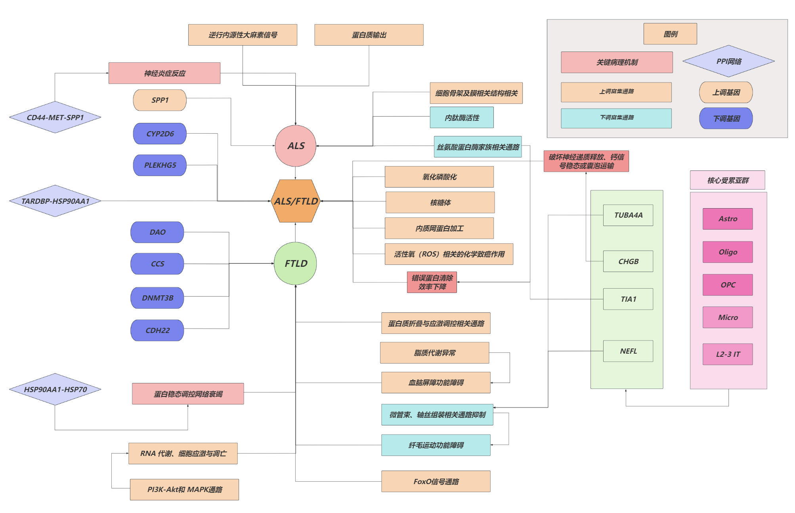

# 基于多队列RNA-seq数据及组合机器学习方法揭示ALS/FTLD疾病谱的转录组异质性

## 主要绘图代码位于my_functions.R中
## 模型训练代码位于model_prepare.R及model_test.R文件中
## 其余脚本为流程处理代码
## final_flow.R为单细胞流程代码
## marker.R为手动注释参考的细胞标记物

### 主要函数均已在函数头上方进行了标注

## 工作流程图

## 模型设计图

## 结果讨论图

